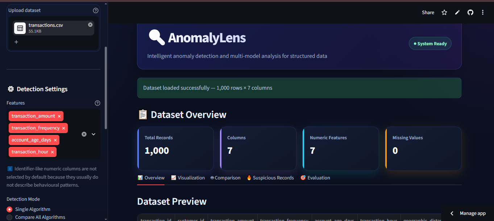

# 🔍 AnomalyLens

### Interactive Machine Learning Anomaly Detection Platform

[](https://anomalylens.streamlit.app)


**Live app:** https://anomalylens.streamlit.app

AnomalyLens is a Streamlit-based machine learning application for detecting, comparing, evaluating, and investigating unusual patterns in structured datasets.

The project combines data analysis, unsupervised machine learning, interactive visualization, model comparison, investigation workflows, automated testing, CI/CD checks, cloud deployment, and container support in one portfolio-ready application.

---

## 🖥️ Dashboard Preview

[](https://anomalylens.streamlit.app)

*Interactive dashboard preview — click the image to open the live Streamlit app.*

---

## 🎯 Why I Built This

I wanted to build something more practical than a notebook-only machine learning project.

AnomalyLens turns anomaly detection into an interactive workflow where a user can move from raw data to model output, visual analysis, investigation, evaluation, and exportable findings without writing code.

The architecture is intentionally modular so the project can continue evolving toward APIs, authentication, multi-user workflows, and product-level capabilities.

---

## 🚀 Current Features

- 📂 Upload CSV and Excel datasets
- 📊 Automatic dataset overview and preview
- 🔢 Automatic detection of numerical features
- 🧹 Median-based handling of missing numerical values
- 🛡️ Target-label exclusion to prevent feature leakage
- 🧠 Smarter default feature selection that skips identifier-like columns
- 🌲 Isolation Forest
- 📍 Local Outlier Factor (LOF)
- 🧭 DBSCAN
- 🔁 Single-model and multi-model comparison modes
- 📈 Interactive Plotly visualizations
- 🎚️ Selectable X/Y axes for anomaly scatter plots
- 🍩 Normal-vs-anomaly distribution view
- 💯 Normalized anomaly scores from 0–100 for Isolation Forest and LOF
- 🚨 Severity labels for scored anomalies
- 🔥 Ranked suspicious-record investigation
- 🤝 Multi-model agreement and consensus analysis
- 📊 Themed model-agreement visualization
- 🎯 Precision, recall, F1 score, and accuracy when ground truth is available
- 🧩 Confusion-matrix visualization for single-model evaluation
- 🏆 Multi-model evaluation table with best-F1 identification
- 📥 Export full analysis and model-comparison results to CSV
- 🎨 Custom dark analytics dashboard with semantic KPI cards
- ⚡ Lazy-loaded ML and visualization dependencies for faster startup
- ✅ Automated unit and visualization regression tests
- 🔍 Ruff-based lint checks
- ⚙️ GitHub Actions CI with compile, test, app health, and Docker smoke checks
- 🐳 Docker and Docker Compose support
- 📦 GitHub Container Registry publishing workflow for version tags
- 🔄 Dependabot configuration for Python, Actions, and Docker dependencies
- ☁️ Public deployment on Streamlit Community Cloud

---

## 🧠 Machine Learning Approach

AnomalyLens currently supports three unsupervised anomaly detection approaches.

### Isolation Forest

Isolation Forest identifies unusual observations by repeatedly partitioning the feature space. Records that can be isolated more quickly are more likely to be anomalous.

AnomalyLens converts the model's raw decision score into a normalized 0–100 anomaly score, where higher values indicate more unusual observations.

### Local Outlier Factor (LOF)

LOF compares the local density of each observation with the density of its neighbors. A point can therefore be identified as unusual even when it is only anomalous relative to its local region.

Its raw outlier scores are also normalized to a 0–100 scale for easier investigation.

### DBSCAN

DBSCAN is a density-based clustering algorithm. Observations that do not belong to a sufficiently dense region are labeled as noise and treated as anomalies in AnomalyLens.

Selected features are standardized before DBSCAN is run. A dedicated normalized DBSCAN anomaly score is planned for a later version.

---

## 🤖 Model Comparison

Comparison mode runs all three algorithms on the same selected feature set and shows:

- anomalies detected by each algorithm
- anomaly percentage by model
- records flagged by at least two models
- records flagged by all three models
- model-agreement distribution
- consensus records for investigation
- model evaluation metrics when labels are available

This is useful because different anomaly detection methods identify different structures in the data.

---

## 🎯 Evaluation

If a dataset contains a recognized binary anomaly label such as `ground_truth`, `is_anomaly`, `anomaly_label`, `label`, or `target`, AnomalyLens can evaluate predictions against it.

For the bundled legacy synthetic sample, ground truth can also be reconstructed from the known injected anomaly transaction IDs.

The Evaluation tab reports:

- Precision
- Recall
- F1 score
- Accuracy
- True positives
- False positives
- False negatives
- Confusion matrix

In comparison mode, the application evaluates all three algorithms and highlights the best F1 score.

Evaluation metrics are intentionally hidden for ordinary unlabeled datasets because unsupervised anomaly detection often operates without ground truth.

---

## 🏗️ Application Flow

```text
Dataset Upload
CSV / Excel
      │
      ▼
Data Processing
Numeric feature detection
Target leakage protection
Identifier-aware defaults
Missing-value handling
      │
      ▼
Detection Mode
Single Algorithm OR Compare All
      │
      ├───────────────┬────────────────┐
      ▼               ▼                ▼
Isolation Forest     LOF             DBSCAN
      │               │                │
      └───────────────┴────────────────┘
                      │
                      ▼
              Result Analysis
       KPIs • Charts • Scores • Severity
       Suspicious Records • Consensus
                      │
          ┌───────────┴───────────┐
          ▼                       ▼
      Evaluation               Export
   if labels exist              CSV
```

---

## 🛠️ Technology Stack

| Technology | Purpose |
|---|---|
| Python | Application and ML logic |
| Pandas | Dataset processing and result handling |
| NumPy | Numerical operations |
| Scikit-learn | Models, scaling, and evaluation metrics |
| Streamlit | Interactive web application and public hosting |
| Plotly | Interactive visualizations |
| OpenPyXL | Excel file support |
| Pytest | Automated testing |
| Ruff | Static linting |
| Docker | Containerized deployment support |
| GitHub Actions | CI and container publishing |
| Git & GitHub | Version control and project history |

---

## 📂 Project Structure

```text
AnomalyLens/
│
├── .github/
│   ├── dependabot.yml
│   └── workflows/
│       ├── ci.yml
│       └── docker-publish.yml
│
├── .streamlit/
│   └── config.toml
│
├── app.py
├── Dockerfile
├── docker-compose.yml
├── pyproject.toml
├── requirements.txt
├── requirements-dev.txt
├── README.md
├── CHANGELOG.md
├── SECURITY.md
├── CONTRIBUTING.md
├── LICENSE
│
├── data/
│   └── transactions.csv
│
├── src/
│   ├── __init__.py
│   ├── anomaly_detection.py
│   ├── data_processing.py
│   ├── evaluation.py
│   ├── generate_data.py
│   ├── scoring.py
│   ├── ui_components.py
│   └── visualization.py
│
└── tests/
    ├── test_anomaly_detection.py
    ├── test_data_processing.py
    ├── test_evaluation.py
    ├── test_scoring.py
    └── test_visualization.py
```

---

## ⚙️ Installation

```bash
git clone https://github.com/MuhammadAman12/AnomalyLens.git
cd AnomalyLens
python -m venv venv
```

### Windows PowerShell

```powershell
Set-ExecutionPolicy -Scope Process -ExecutionPolicy RemoteSigned
.\venv\Scripts\Activate.ps1
pip install -r requirements.txt
streamlit run app.py
```

### macOS / Linux

```bash
source venv/bin/activate
pip install -r requirements.txt
streamlit run app.py
```

---

## 🧪 Development Checks

Install development dependencies:

```bash
pip install -r requirements-dev.txt
```

Run the same core checks used by CI:

```bash
ruff check app.py src tests
python -m py_compile app.py src/*.py tests/*.py
pytest
```

---

## 🐳 Docker

Build and run locally:

```bash
docker build -t anomalylens:local .
docker run --rm -p 8501:8501 anomalylens:local
```

Or use Docker Compose:

```bash
docker compose up --build
```

The application will be available at `http://localhost:8501`.

See `DEPLOYMENT.md` for release and deployment guidance.

---

## ☁️ Public Demo

The portfolio build is deployed on Streamlit Community Cloud:

**https://anomalylens.streamlit.app**

The hosted version tracks the public `main` branch of this repository.

---

## 🧪 Example Dataset

The repository includes a synthetic transaction dataset designed for testing anomaly detection.

It contains 1,000 records:

- 950 normal transactions
- 50 intentionally injected anomalous transactions

Example behavioral features include transaction amount, frequency, account age, transaction hour, and geographic distance.

The latest generator also writes a `ground_truth` column so model quality can be evaluated directly after regenerating the dataset.

---

## 🔮 Roadmap

Completed:

- [x] Isolation Forest detection
- [x] Local Outlier Factor detection
- [x] DBSCAN detection
- [x] Multi-algorithm comparison
- [x] Normalized anomaly scoring for Isolation Forest and LOF
- [x] Severity-based suspicious-record ranking
- [x] Consensus anomaly analysis
- [x] Identifier-aware feature defaults
- [x] Target leakage protection
- [x] Precision, recall, F1, and accuracy evaluation
- [x] Confusion-matrix reporting
- [x] Multi-model evaluation comparison
- [x] Modular application architecture
- [x] Custom dashboard styling
- [x] Automated tests
- [x] GitHub Actions CI
- [x] Docker support
- [x] Container publishing workflow
- [x] Dependabot configuration
- [x] Public cloud deployment
- [x] Startup-performance optimization with lazy imports

Planned:

- [ ] DBSCAN-specific anomaly scoring
- [ ] Additional visual analytics
- [ ] REST API separation
- [ ] Authentication and multi-user support

---

## 🎓 What This Project Demonstrates

AnomalyLens demonstrates practical experience with:

- unsupervised machine learning
- data preprocessing
- target leakage prevention
- anomaly scoring and severity
- model comparison and evaluation
- exploratory data analysis
- interactive visualization
- modular Python application design
- automated testing and linting
- CI/CD workflows
- cloud deployment
- containerized deployment support
- performance-oriented lazy loading
- Streamlit application development
- Git and GitHub workflow

---

## 👤 Author

**Muhammad Aman**

GitHub: [MuhammadAman12](https://github.com/MuhammadAman12)
